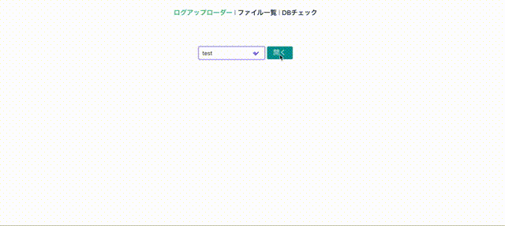
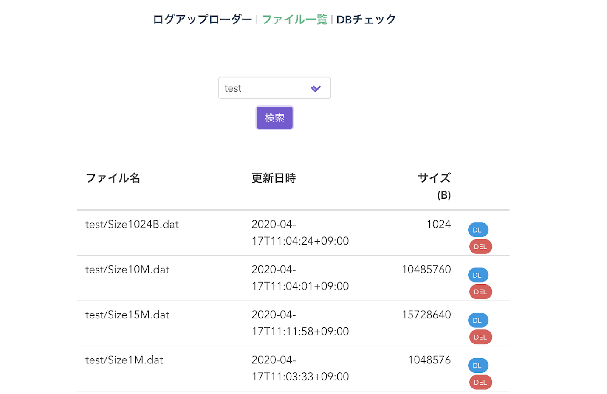

# s3-file-uploader

## background

Web application proxying S3 access because my company proxy prohibits S3 access(OMG).

## Install

### Precondition

- Node.js (more v10.15.x)
- Go (more 11.1)
- Docker(If you use)

### Install dependencies

```
make backend-install
make front-install
```

### Set your environment

- Fix front config for your environment to refer [sample.json](https://github.com/tubone24/s3-file-uploader/blob/master/src/front/config/env/sample.json)

- Fix backend config for your environment to refer [sample.toml](https://github.com/tubone24/s3-file-uploader/blob/master/src/backend/config/env/sample.toml)

If you create `dev` config, set `dev.json`, `dev.toml` for 2 config name.

### Build

```
make front-build ENV=foo
make backend-build END=foo
```

## Usage

Run local

```
make backend-run ENV=foo
```

Use Docker

```
make docker-build ENV=foo
```

## Demo

Upload File



List S3 files


